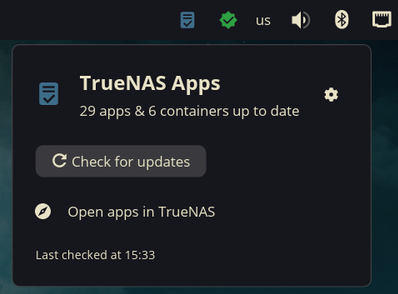
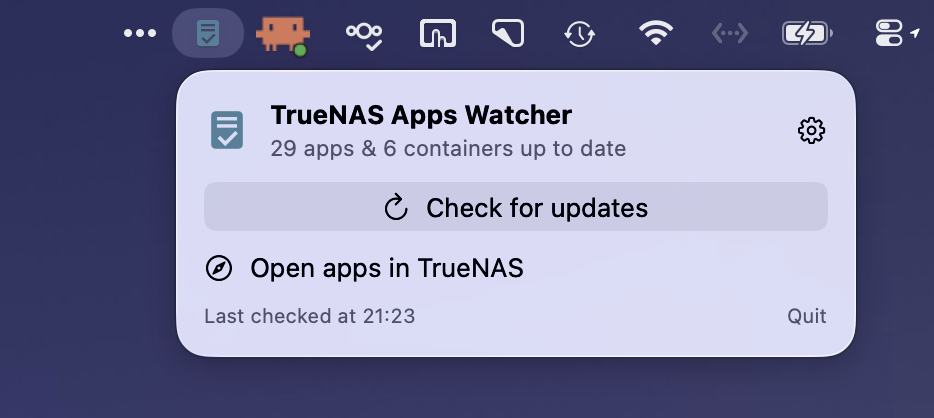
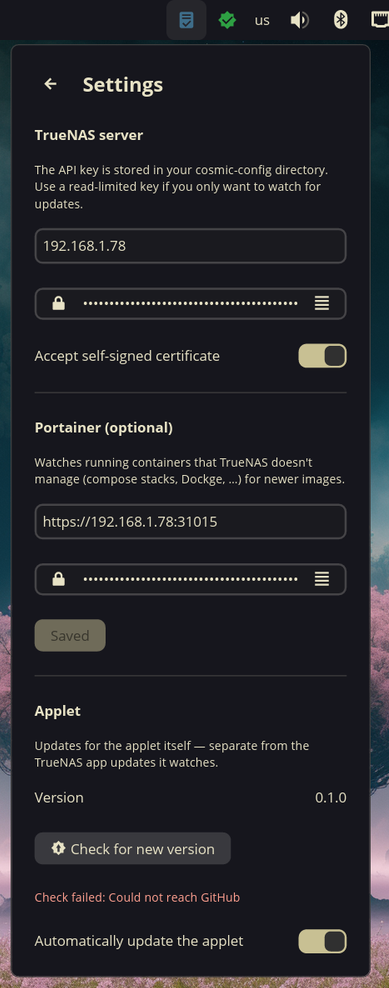

# TrueNAS Apps Watcher

Keep an eye on your **TrueNAS SCALE** apps from your desktop: a panel applet
for the [**COSMIC**](https://system76.com/cosmic/) desktop on Linux and a
**menu bar app for macOS**, both watching your server for pending app
(Docker) updates — and, optionally, any other containers you run beside them
— and applying everything without opening a browser.

| Linux (COSMIC) | macOS |
|:---|:---|
| Panel applet for Pop!_OS and the COSMIC spins/packages of Fedora, Arch, NixOS, openSUSE, … (`cosmic/`) | Menu bar app, **no Dock icon**, for macOS 13+ on Apple Silicon or Intel (`macos/`) |
|  |  |

## What it does

- **Panel / menu bar icon** — a NAS-shaped badge in TrueNAS blue with the
  number of pending updates, or a muted ✓ variant when everything is up to
  date.
- **Popup** (click the icon) lists the pending updates, split into:
  - **App updates** — TrueNAS catalog version bumps, shown as
    `current → latest`.
  - **Image updates** — TrueNAS apps whose Docker image has a newer build
    available (typical for custom apps tracking a `latest` tag).
  - **Containers (Portainer)** — optional: running containers *outside*
    TrueNAS's apps (compose stacks, Dockge, hand-run containers…), watched
    through a Portainer instance. The app lists them via Portainer's Docker
    API proxy (skipping the `ix-*` projects TrueNAS manages) and flags any
    whose image tag has a newer digest at its registry — the same check
    Watchtower does. Works anonymously with Docker Hub, ghcr.io, lscr.io,
    and other standard registries.
- **"Check for updates"** asks TrueNAS to re-sync its app catalog (the same
  thing its daily cron does), re-queries, and re-checks unmanaged containers
  against their registries, so brand-new releases show up immediately.
- **"Apply N updates"** applies everything server-side: catalog upgrades go
  through the `app.upgrade` job, image updates through `app.pull_images`,
  and unmanaged containers are pulled with live per-layer progress and then
  recreated through Portainer (same as its *Recreate* button). Items are
  updated one at a time and a progress bar tracks them; the badge clears
  when they finish. Failures for one item don't stop the rest.
- **"Open apps in TrueNAS"** opens the web UI's installed-apps page in your
  browser.
- **Settings** — TrueNAS address + API key, optional Portainer address +
  access token (keys masked once saved, with an eye toggle), self-signed-
  certificate acceptance, and an update check for the app itself. On Linux
  the settings live in the popup (⚙); on macOS they open in a standard
  Settings window, and there's a **start at login** toggle. The Linux applet
  can also update *itself* automatically from this repo's releases.

TrueNAS apps are re-checked every 30 minutes, so updates that appear (or are
installed elsewhere, e.g. from the TrueNAS UI) show up without interaction.
Unmanaged containers are re-checked every 6 hours (each image lookup hits its
registry, and Docker Hub rate-limits anonymous requests). Everything also
runs on startup and on any manual check.

## Requirements

- **TrueNAS SCALE** with the Docker-based apps system (24.10 "Electric Eel"
  or newer; tested on 25.10). The app talks to the `/api/v2.0` REST
  endpoints with a Bearer API key.
- A TrueNAS **API key**: TrueNAS web UI → click the ⚙ icon (top right) →
  **API Keys** → **Add**. Checking for updates only reads; applying updates
  calls `app.upgrade`, so use a full-access key (or a key limited to the app
  service) if you want the update button to work.
- *(Optional)* **Portainer** 2.19+ with an **access token** (Portainer →
  click your user name → **Access tokens** → **Add**) to also watch
  containers TrueNAS doesn't manage. Tested with Portainer CE 2.43.
- Linux: a desktop running **COSMIC**. macOS: **13 Ventura** or newer.

## Install

One command on either platform — the installer detects your OS:

```sh
curl -fsSL https://raw.githubusercontent.com/davidboulay/TruenasAppsWatcher/main/install.sh | bash
```

**Linux**: downloads the prebuilt applet binary from the latest
[release](https://github.com/davidboulay/TruenasAppsWatcher/releases)
(x86_64 glibc), or builds from source elsewhere (Rust toolchain +
`libxkbcommon-dev libwayland-dev pkg-config`). Then add it to the panel:
**Settings → Desktop → Panel (or Dock) → Add Applet → "TrueNAS Apps
Watcher"**.

### Linux: install with apt (.deb) instead

Every release also ships a Debian package (amd64) — the right choice if you
prefer a system-managed install on Pop!_OS / Ubuntu-based distros:

```sh
curl -fsSLO https://github.com/davidboulay/TruenasAppsWatcher/releases/latest/download/truenas-apps-watcher_amd64.deb
sudo apt install ./truenas-apps-watcher_amd64.deb
```

Remove it again with `sudo apt remove truenas-apps-watcher`.

Notes on the apt install:
- The applet's built-in **"Automatically update the applet"** only works for
  user-local installs (the curl installer above) — a deb-managed binary in
  `/usr/bin` isn't writable by your session. To update, download and
  `apt install` the newer .deb the same way.
- If you previously used the curl installer, remove the user-local copy so
  it doesn't shadow the packaged one:
  `rm ~/.local/bin/cosmic-applet-truenas-apps ~/.local/share/applications/com.github.davidboulay.CosmicAppletTruenasApps.desktop`

**macOS**: installs **TrueNAS Apps Watcher.app** (universal binary) to
/Applications, clears the quarantine flag (the app is ad-hoc signed, not
notarized), and launches it. Look for the blue NAS icon in the menu bar.

Prefer doing it by hand? Download **TrueNAS-Apps-Watcher.dmg** from the
[latest release](https://github.com/davidboulay/TruenasAppsWatcher/releases/latest),
open it and drag the app onto the Applications folder, then right-click →
**Open** the first time (unsigned-app prompt).

Then click the icon, open Settings (⚙) and enter the server address and API
key.



## Security notes

- The API key and Portainer token are stored **in plain text** in the
  platform's usual settings store — cosmic-config on Linux
  (`~/.config/cosmic/com.github.davidboulay.CosmicAppletTruenasApps/`),
  preferences on macOS
  (`~/Library/Preferences/com.github.davidboulay.TruenasAppsWatcher.plist`).
  Don't use this on a shared account, and prefer keys scoped to what you
  need.
- "Accept self-signed certificate" (default on) disables TLS certificate
  verification for the TrueNAS and Portainer connections — fine on a trusted
  LAN, turn it off if your server has a proper certificate.

## Build from a checkout

```sh
# Linux (COSMIC applet)
cargo build --release --manifest-path cosmic/Cargo.toml
./install.sh

# macOS (menu bar app)
cd macos && swift build -c release && ./scripts/make_app.sh
open "dist/TrueNAS Apps Watcher.app"
```

## License

GPL-3.0-only
